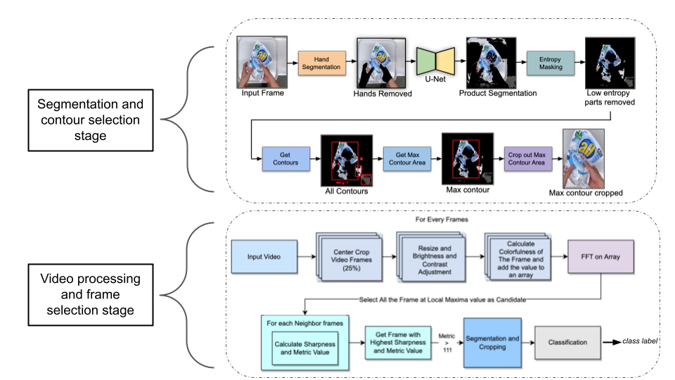

## VISTA: Vision Transformer enhanced by U-Net and Image Colorfulness Frame Filtration for Automatic Retail Checkout

Code for our CVPR 2022 Workshop paper *VISTA: Vision Transformer enhanced by U-Net and Image Colorfulness Frame Filtration for Automatic Retail Checkout*. The method described achieves 3rd place in the AI City Challenge 2022 Track 4: Multi-Class Product Counting & Recognition for Automated Retail Checkout. See [here](https://www.aicitychallenge.org/2022-data-and-evaluation/) for details.

[[arXiv](https://arxiv.org/abs/2204.11024)]

    
  <em> 
    Figure 1. Illustration of the overall segmentation and classification pipeline
    </em>

## 1. Specification of dependencies

This code requires Python 3.8.12 and PyTorch 1.8.2. Run `pip install -r requirements.txt` to install all the dependencies.

## 2a. Segmentation training code
See [`training/segmentation`](training/segmentation/README.md) for details.

## 2b. Classification training code
See [`training/classification`](training/classification/README.md) for details.

## 3. Inference code

After steps 2a and 2b, make sure both segmentation and classification models are present in the [`test/models`](test/models/) directory. Then see [`README.md`](test/README.md) for details.

## 4. Citation
will be added here.

### Acknowledgements

We thank [AICITY 22](https://www.aicitychallenge.org/) organizers for making data available for use. We also thank [Giga Tech Ltd.](https://gigatechltd.com/) for providing funding for this work.
